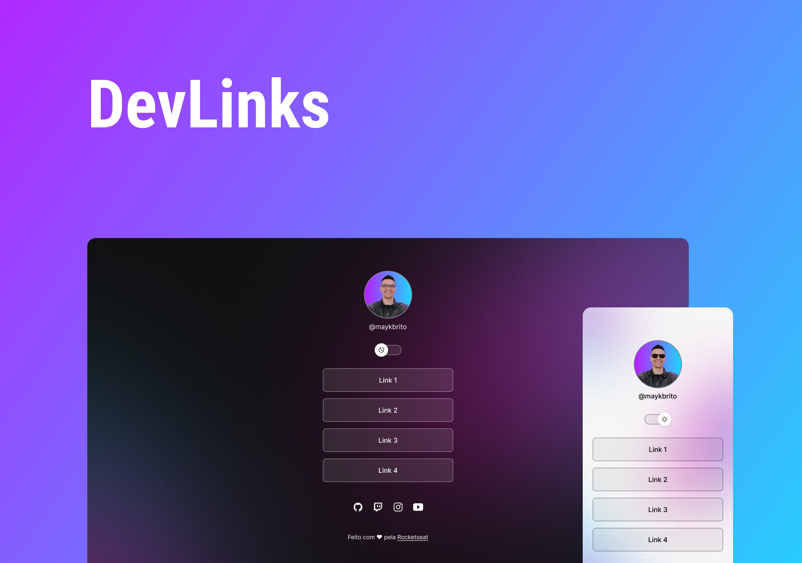

<h1 align="center"> Dev Link </h1>

Programa exclusivo e gratuito, provido pela Rocketseat para o ensino de tecnologias WEB  

  <a href="#-tecnologias">Tecnologias</a>&nbsp;&nbsp;&nbsp;|&nbsp;&nbsp;&nbsp;
  <a href="#-projeto">Projeto</a>&nbsp;&nbsp;&nbsp;|&nbsp;&nbsp;&nbsp;
  <a href="#-layout">Layout</a>&nbsp;&nbsp;&nbsp;|&nbsp;&nbsp;&nbsp;

  

 

  

## 🚀 Tecnologias

Esse projeto foi desenvolvido com as seguintes tecnologias:

- HTML e CSS
- JavaScript
- Git e Github
- Figma

## 💻 Projeto

Cartão de visita.

- [Visite o projeto online](https://adnramos.github.io)

## 🔖 Layout

Você pode visualizar o layout do projeto através [DESSE LINK](https://www.figma.com/file/Lq1JCFXlTZGl9jk0Rzhj29/DevLinks-(Community)?node-id=0%3A1&t=pWqxz5KikqrKaIhA-0). É necessário ter conta no [Figma](https://figma.com) para acessá-lo.

---

